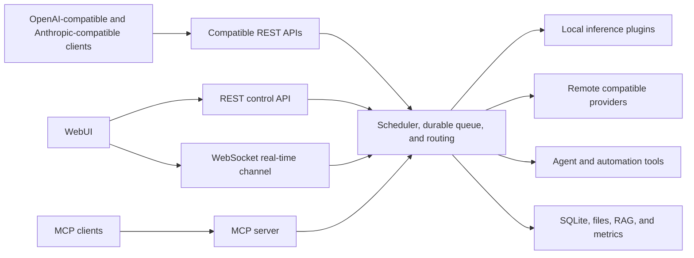

# SoAI: Smart Orchestrator for Artificial Intelligence

SoAI is a feature-rich agent orchestration system that runs local inference engines and remote providers behind one resilient orchestration layer. It provides OpenAI-compatible and Anthropic-compatible client APIs and a complete WebUI with chat, tools, automations, file management, hardware control, and a RAG knowledge base.

[Documentation](https://soai.to/documentation/) · [Project and releases](https://github.com/GetSoAI/SoAI) · [Release notes](RELEASE_NOTES.md) · [SoAI Connect](https://github.com/GetSoAI/SoAI_Connect) · [License](LICENSE.md) · [Privacy](PRIVACY.md) · [Security](SECURITY.md)

## Contents

- [What SoAI solves](#what-soai-solves)
- [Architecture](#architecture)
- [Inference and model management](#inference-and-model-management)
- [Compatible client APIs](#compatible-client-apis)
- [Scheduling and resilience](#scheduling-and-resilience)
- [WebUI and agents](#webui-and-agents)
- [Tools, automations, and integrations](#tools-automations-and-integrations)
- [Hardware and operations](#hardware-and-operations)
- [Plugins](#plugins)
- [SoAI OS](#soai-os)
- [System requirements](#system-requirements)
- [Install SoAI](#install-soai)
- [Updates and release verification](#updates-and-release-verification)
- [Licensing and privacy](#licensing-and-privacy)
- [Security](#security)
- [Contact](#contact)

## What SoAI solves

Each inference backend (llama.cpp, Ollama, vLLM) and each remote provider has its own API, model names, and process lifecycle. You need to install, update, and manage them manually. Every tool you use is configured for one backend at a time. Switching backends means downtime, reloads, or fiddling with your clients. If a backend crashes, requests fail.

SoAI puts compatible API endpoints in front of all of them. OpenAI-compatible clients such as Open WebUI, Continue, and Cursor can point at SoAI once, as can Anthropic-compatible clients such as Claude Code. Both formats provide access to every configured model, and custom scripts can use either one. SoAI handles routing, starts and stops local backends on demand, retries or reroutes when something fails, and queues requests so backends do not overload. SoAI supports load balancing and failover across backends and providers through virtual models. You can also use SoAI on its own. Its WebUI is a complete multi-user and multi-device environment for chat, agents, and day-to-day work with your models. All connected devices see the same thing in real time. With the WebUI, you can also monitor, test, and control your GPU by setting power limits, core and memory frequencies, and fan speed.

The UI ships in 22 languages:

🇿🇦 Afrikaans, 🇸🇦 Arabic, 🇨🇳 Chinese (Simplified), 🇹🇼 Chinese (Traditional), 🇳🇱 Dutch, 🇬🇧 English, 🇫🇷 French, 🇩🇪 German, 🇮🇳 Hindi, 🇮🇩 Indonesian, 🇮🇹 Italian, 🇯🇵 Japanese, 🇰🇷 Korean, 🇮🇷 Persian, 🇵🇱 Polish, 🇵🇹 Portuguese, 🇷🇺 Russian, 🇪🇸 Spanish, 🇹🇭 Thai, 🇹🇷 Turkish, 🇺🇦 Ukrainian, and 🇻🇳 Vietnamese.

## Architecture



SoAI separates these protocol surfaces:

- Client requests to `/v1/*` use REST. OpenAI-compatible streams use OpenAI SSE, while Anthropic Messages streams use Anthropic named SSE events
- WebUI and administration requests to `/api/v1/*` use REST
- WebSocket connections to `/api/v1/system/ws` carry live events, snapshots, and interactive sessions such as terminals
- MCP requests to `/mcp` use streamable HTTP and require a personal access token

## Inference and model management

SoAI bundles eight plugins for inference and remote-provider access:

| Plugin | What it does |
| --- | --- |
| Ollama | Runs local models through a managed Ollama server and connects to Ollama Cloud. SoAI downloads and controls the local Ollama binary. Linux, Windows, and macOS. |
| llama.cpp | Runs GGUF models directly. SoAI manages its own llama-server process. CPU, NVIDIA, AMD, Vulkan, and Apple Metal. Linux, Windows, and macOS. |
| vLLM | High-throughput inference for transformer and GGUF models. NVIDIA, AMD, and Intel GPUs. Linux and macOS (CPU only on Apple Silicon). No Windows support. |
| cTranslate2 | Translation using Helsinki-NLP Marian models converted to CTranslate2 format. CPU only. Linux, Windows, and macOS. |
| Embedding | Dedicated embedding runtime for GGUF models. Same hardware and platform support as llama.cpp. |
| Whisper | Speech-to-text using OpenAI Whisper models. CPU, NVIDIA, AMD, Apple MPS, and Intel XPU. Linux, Windows, and macOS. |
| MeloTTS | Multilingual text-to-speech with downloadable language packs. CPU, NVIDIA, and Apple MPS. Linux, Windows, and macOS. |
| External | Connects to any cloud or local OpenAI-compatible API: OpenRouter, OpenAI, Anthropic, Groq, Together AI, a local inference backend, or another SoAI instance. All platforms. |

### Model and plugin setup

- Search for and download supported models from remote sources such as Hugging Face and Ollama or from local storage
- Select model variants and quantizations if the model provider exposes them
- Review download size and resource estimates before installation
- Upload model files or place them in a configured model directory
- Store per-model configuration, parameters, and backend startup options
- Assign GPUs to plugins that run on your system
- Install, update, and remove managed local plugin backends. The External plugin connects to an existing API and does not manage that provider's installation lifecycle

Each plugin defines its supported formats, devices, model options, and startup controls. Check the plugin page in the WebUI for the options available on your machine.

### Virtual models and routing

A virtual model assigns one model identifier to two or more configured models. Each target pairs a model with the plugin that serves it. SoAI handles GPU availability and the number of runnable plugins based on the user settings. The router scores eligible targets by backend availability, queue pressure, and whether the plugin has loaded the model. If one target fails, the router can select another eligible target with no interruptions for the client connected to SoAI.

`/v1/models` lists configured models even when a local backend has stopped. SoAI can start that backend for a request. If `MAX_CONCURRENT_PLUGINS` has no free slot, SoAI can unload an inactive backend first.

### Model compatibility

Backends differ in the message sequences their chat templates accept. Some reject the `system` role, require system content at the start, or require user and assistant turns to alternate strictly. When a model rejects a request for one of those reasons, SoAI rewrites the message sequence into an accepted form and retries, then caches the working form by plugin, provider, and source model so later requests skip the failed attempt. SoAI supports any model format and quantization supported by installed plugins. Capability overrides can turn off an endpoint, modality, or feature that a backend advertises.

## Compatible client APIs

SoAI implements OpenAI-compatible endpoints plus an Anthropic-compatible Messages surface for Claude Code. For inference and media requests, the selected model and plugin determine which operations and fields they support.

| Capability | Endpoint |
| --- | --- |
| Chat completions | `/v1/chat/completions` |
| Responses | `/v1/responses` |
| Anthropic Messages | `/v1/messages` and `/v1/messages/count_tokens` |
| Legacy completions | `/v1/completions` |
| Models | `/v1/models` |
| Embeddings | `/v1/embeddings` |
| Image generation, editing, and variations | `/v1/images/*` |
| Audio transcription, translation, and speech | `/v1/audio/*` |
| Files | `/v1/files/*` |

To connect a client, set the base URL, model identifier, and API key if you created one. OpenAI-compatible clients use the OpenAI routes; Claude Code uses the Anthropic Messages routes. End-to-end support depends on the endpoints and fields the client sends and on the selected model and plugin.

OpenAI-compatible streaming requests use OpenAI SSE records and terminate with `data: [DONE]`. SoAI does not insert WebSocket envelopes into `/v1/*` streams.

The Anthropic Messages routes use Anthropic request, response, error, and named-SSE event shapes. They accept the same SoAI API key through either `x-api-key` or a bearer token.

### Authentication and quotas

Until you create the first user, SoAI blocks `/v1/*`, MCP, and protected `/api/v1/*` routes. It leaves the setup wizard, health checks, static UI assets, and the public information routes needed for setup open. After setup, users sign in to the WebUI with session authentication.

After setup, `/v1/*` handles API keys as follows:

- With no configured keys, the API accepts requests without a bearer token
- Creating the first key makes a valid bearer token mandatory
- Revoking a key disables it and leaves key authentication on
- Deleting all keys opens the API again

Create a key before you make an instance reachable beyond loopback or a trusted private network. Until the first key exists, anyone who can reach the port can use `/v1/*`.

SoAI stores API keys as salted HMAC hashes and shows the plaintext once, at creation. A key can have an expiration date, a rotation reminder, and request or token quotas for hourly, daily, weekly, and monthly windows. You can also throttle selected routes by client IP.

SoAI requires authentication for MCP. Each user creates personal access tokens in the WebUI.

## Scheduling and resilience

### Queues and concurrency

SoAI manages inference capacity in layers. It orders waiting requests, limits how much work each user or background workload may run, limits how many local backends run at once, and gives each plugin its own bounded queue.

Queue size, per-plugin concurrency, request timeouts, and inactivity-based unloading are separate controls. Controlled testing showed that SoAI remains available and usable through bursts of thousands of simultaneous requests across one or multiple plugins. Longer request timeouts allow more queued requests to complete when required.

Plugins report whether their backend should handle one request at a time or several in parallel. The central orchestrator still owns the queues and enforces the concurrency limit for every plugin. All models served by the same plugin share that capacity.

The scheduler includes:

- Exact-request deduplication, allowing matching in-flight requests to share one inference run
- Bounded retries for transient failures and server errors that the retry policy marks safe
- `Retry-After` handling for rate-limited remote responses
- Client-disconnect cancellation when the configuration enables it and the selected plugin supports it
- Durable records that SoAI reconciles after a process restart

### Health monitoring

The Plugin Guardian watches plugin and runtime health. It detects hung inference and health-ping failures, then inspects runtime state for persistent errors, stuck transitions, or flapping. Recovery revalidates persistent runtimes in place (for managed runtimes, it stops the backend and requests model discovery so configured models can start again). Guardian recovery has a separate attempt limit. SoAI quarantines a plugin and trips its circuit breaker when recovery attempts are exhausted or recovery times out. The Plugins page reports both states and lets you reset the circuit after correcting the cause.

For local inference plugins, the circuit breaker counts request failures that affect plugin health within a configurable window. Reaching the threshold opens the circuit and blocks new dispatch. When the cooldown expires, the circuit enters a half-open state and admits one probe. Success closes the circuit (a failure opens it again).

### Disk protection

SoAI checks available storage before supported operations start writing and it reserves the expected capacity when the total size is known and reserves each chunk as it arrives when the final size is unknown. Space claimed by active jobs counts against what remains available, which prevents concurrent operations from relying on the same free capacity. SoAI also retains a configurable safety margin (750 MiB by default). If there is not enough room, the affected operation returns a disk-space error. Reservations left by ended processes stop counting during the next check. This protection covers downloads, uploads, file operations, backup and restore, archive extraction, browser and media output, and knowledge-base storage.

### Offline mode

Offline mode limits SoAI network access to loopback, private, and link-local addresses. The WebUI remains available over your local network, and installed backends can continue to run local inference. Requests to public providers and websites return an offline-mode error.
SoAI disables model downloads, backend installation and updates, software updates, and mail and calendar synchronization while offline. Changes to offline mode take effect without restarting SoAI.

## WebUI and agents

The WebUI is where users chat with agents and manage their SoAI instance. Conversations can be searched, cloned, edited, and regenerated. Live views show requests, queues, plugin state, and hardware or network activity. Each account only sees the pages and actions it can access. SoAI saves interface preferences and supported page layouts per user. Chat, logs, terminal, and hardware can open in separate windows, while large conversations, file listings, and logs remain usable as they grow.
The same interface handles models, backends, files, knowledge, terminal sessions, prompts, and automations. Settings cover connected mail, calendar, and messaging accounts as well as users, permissions, backups, and system configuration.

### Conversations

Chat mode handles normal replies, Plan mode prepares and tracks steps, and Execute mode lets the agent act through enabled tools. Plans, tool calls, arguments, results, code changes, media, and subagent activity appear in the transcript as the work happens. You can require approval for protected tools, answer questions from the agent, queue another message, steer active work, or stop the run. SoAI exports the complete conversation as JSON or as a styled PDF containing the transcript, model details, attachments, tool activity, compactions, and comparison variants.

Each conversation keeps its model selection, system prompt, generation settings, tool access, workspace folder, knowledge, voice setup, and display choices with the transcript. You can change models between turns or compare replies from several models to the same prompt, then move among their answers in place. Reusable presets carry selected parts of a setup into other conversations. SoAI keeps the complete history even after older messages leave the model's active context. Conversations can be renamed, colored, favorited, archived, or cloned. A clone is an independent copy, while editing an earlier user message or regenerating an answer removes the later turns and starts again from that point. Unsent drafts sync between devices, and SoAI preserves your local text if another device changes the same draft. Context compaction summarizes older material for the model without removing it from the visible transcript, allowing long-running work to continue.

Direct attachments give the current message access to selected files or folders. Knowledge uploads index larger collections for retrieval throughout the conversation. You can upload from your device, browse the SoAI workspace, paste SoAI local file links, or use a camera to photograph a document. Supported parsers can handle source code, office documents, PDFs, images, audio, video, archives, and messaging exports. Configured speech models also support dictation, spoken replies, and hands-free voice calls.

## Tools, automations, and integrations

### Agent and MCP tools

SoAI registers more than 100 tools for chat and background automations. They cover:

- Web search, browsing, screenshots, downloads, and browser automation
- File operations, archives, OCR, document conversion, and metadata
- Shell commands and interactive terminal sessions
- Image generation and editing
- Speech, audio, and video processing
- Mail, calendar, messaging, and notifications
- Knowledge-base ingestion and retrieval
- Model, plugin, queue, task, system, and GPU operations
- Power actions and administrative controls covered by the caller's permissions

SoAI supports MCP in both directions:

- External MCP clients can use SoAI's authenticated `/mcp` server
- SoAI assistants can connect to other streamable HTTP MCP servers and use their tools

### Coding agents

A coding agent can use SoAI in three ways, and they solve different problems:

| Route | What the agent gets |
| --- | --- |
| `/v1` API | SoAI's routed models through compatible client APIs. |
| `/mcp` server | SoAI's tools, resources, and prompts over streamable HTTP. The agent keeps its own model. |
| WebUI terminal | A shell on the SoAI host through an interactive PTY. The agent keeps its own model and provider configuration. |

#### Compatible clients

SoAI can provide models to coding agents and other clients that accept a custom OpenAI-compatible or Anthropic-compatible endpoint. Configure the client with the SoAI server address, a SoAI model or virtual model identifier, and a SoAI API key.

Requests through either format use the same model resolution, capability validation, queueing, quotas, routing, failover, token accounting, and cancellation flow. Clients can also connect separately to SoAI's `/mcp` server for tools, resources, and prompts. The model API and MCP connections can be used separately or together.

The [documentation](https://soai.to/documentation/) includes general connection instructions and setup guides for supported coding agents and other compatible clients.

### Automations

Automations let SoAI carry out agent work in the background at a chosen local time. Run a task once or repeat it hourly, daily, weekly, monthly, or yearly. A task can contain several ordered turns, allowing one run to research a subject, work with the results, and prepare an answer. Choose its model, workspace folder, model settings, and tools, set a time limit, and decide if tool use must wait for approval.

The calendar interface in the SoAI WebUI shows upcoming and past runs in day, week, or month views. You can disable an automation without deleting it, change its schedule, remove individual occurrences, and stop queued or active work. Live status updates show each run's progress, with its plan, current work, and result excerpt available in the run details. Every run is also saved as a conversation with a full transcript. Transcripts remain available after their automation is deleted, and optional notifications can report when a run completes or fails.

### Files

The Files page in the WebUI gives each account a workspace on the SoAI server. An administrator can assign the same folder to several accounts for shared work, while permissions control what each person can read or change. You can browse folders or enter a path, search and sort entries, and switch between list and icon views. Upload individual files or complete folders (huge files are supported as well as parallel uploads), create folders and text files, and edit text in the browser. Images, audio, and video open in the built-in preview. You can copy, move, download, or delete one item or a selection, with progress and partial failures shown during larger jobs. Folder and multi-file downloads are sent as ZIP archives.
To use a stored file or folder in a conversation, select Attach on the Files page and paste its SoAI link into the conversation. You can also browse your files directly from the Chat page. SoAI reads the item from the assigned workspace without creating another upload.

### Mail, calendar, and messaging

Each user connects mail and calendar accounts in Settings with a password or OAuth. SoAI can test a connection, sync it on demand, and show the last error if something fails. Settings manages the account; agents work with it through enabled tools. Mail can arrive through IMAP or POP3 and go out through SMTP. An agent can find and read messages, save attachments to Files, prepare drafts, send or reply to messages, and update folders or message state. CalDAV tools let the agent find events, create or change one-off and recurring events, respond to invitations, and use event reminders.

Messaging accounts connect Telegram, WhatsApp, or Discord to SoAI. A provider thread becomes a persistent WebUI conversation, and the agent's reply returns through the same service. Each account keeps its own model and agent setup, workspace, tools, and sender policy. You can admit named sender IDs or anyone who can reach the bot. Incoming files and media are supported and processed as attachments.

### SoAI Connect

[SoAI Connect](https://github.com/GetSoAI/SoAI_Connect) is an MIT-licensed Android client specifically made to work with your SoAI server. An iOS-compatible version will be released in the future.

Download the APK from the Releases section of the [SoAI Connect project](https://github.com/GetSoAI/SoAI_Connect) or from soai.to.

## Hardware and operations

### Monitoring and GPU control

The Hardware page follows the whole host machine in real time. It shows CPU activity, memory and swap use, storage volumes, network traffic, running processes, and every detected GPU. GPU readings can include core and VRAM use, temperature, power draw, power limit, core and memory clocks, and active processes. SoAI keeps history for CPU, GPU, disk, and network metrics, with selectable devices, measurements, time ranges, chart styles, aggregation intervals, and CSV export.
GPU controls are based on the capabilities SoAI detects for each device. Supported NVIDIA GPUs can expose power, core and memory clock, fan, and reset controls. AMD GPUs can expose power, graphics and memory clock, and fan controls, while Intel GPUs can expose power and core-frequency controls. Available controls and ranges depend on the GPU, platform, driver tools, permissions, and administrator policy. Three settings slots per GPU let you save a known configuration, preview or apply it later, and optionally restore it when the system starts. After an unsafe shutdown, SoAI returns supported tuning controls to their defaults and disables automatic restoration until the saved settings are deliberately reapplied.

SoAIBench tests the GPU itself for inference readiness instead of timing a particular model or backend. Standard and stress runs exercise compute, matrix operations, memory bandwidth, dispatch latency, and sustained mixed workloads while tracking utilization, power, temperature, stability, and score variance. SoAI reports progress as the test runs, records whether the result qualifies for certification, and keeps per-GPU history that can be reviewed, copied, or exported.

### Terminal

The Terminal page opens an interactive shell on the machine running SoAI, directly in the WebUI. It supports any command line application, resizes with the browser window, keeps scrollback for the current session, and lets you change the text size or clear the display. You can also open the terminal in a separate window.
Commands have the permissions of the operating-system account running SoAI, and administrators control which users can open the terminal.

### Backup and restore

A backup covers the database, configuration, plugin settings, uploaded user data, GPU presets, and more. Restore validates and stages the archive before it replaces active files. From the WebUI, you can schedule periodic backups or perform backups manually.

## Plugins

Plugins let SoAI support additional inference engines and capabilities while keeping the same API and WebUI. You can add trusted third-party plugins from a file or URL and manage them from the WebUI, which also shows when a plugin cannot run or needs attention. Plugins run software on the SoAI host, so only install them from sources you trust.
If a local or remote service already offers an OpenAI-compatible API, the External plugin can connect it directly, so you do not need to create a custom plugin. Developers who want to build a new integration can follow the guides in the [documentation](https://soai.to/documentation/).

## SoAI OS

SoAI OS is a full-featured appliance edition built on SoAI Core. Its UEFI Debian 13 KDE custom image supports AMD64 and ARM64 and includes installation, encrypted deployment, recovery, and hardware checks. SoAI OS will be released in the future.

## System requirements

SoAI works on CPU-only machines and on machines with one or more GPUs. A GPU is optional, but it is needed for reasonable local inference speeds.

| Resource | Minimum | Recommended |
| --- | --- | --- |
| CPU | Intel Core i5-2500 or AMD FX-6100 (64-bit CPU with AVX support) | Intel Core i7-6700 or AMD Ryzen 5 1600 |
| RAM | 4 GB DDR3 | 16 GB DDR4 |
| Storage | 128 GB SATA SSD | 512 GB NVMe SSD |
| GPU | Optional.<br>**NVIDIA:** Compatible Pascal-generation GeForce GTX 10-series, Quadro P-series, or Tesla P-series cards.<br>**AMD:** A GPU supported by the selected ROCm or Vulkan runtime.<br>**Intel:** A GPU supported by the selected XPU, SYCL, OpenVINO, Vulkan, or OpenCL runtime. | **NVIDIA:** Compatible Ampere-generation GeForce RTX 30-series, RTX A-series, or Ampere data-center cards.<br>**AMD:** Radeon RX 6000/7000-series or Instinct MI200/MI300-series GPUs.<br>**Intel:** Arc A-series/B-series or Data Center GPU Max cards. |
| Operating system | Debian 12 or 13<br>Ubuntu 24.x or 26.x<br>Windows 10 or 11<br>Experimental macOS | Same supported operating systems |

The amount of RAM and VRAM required for inference depends on the models, quantization, context length, and plugins you use rather than on SoAI alone. Larger models and concurrent requests need more memory, and model files, plugin backends, databases, user files, and working space require storage beyond the application itself.

SoAI can run from a hard disk drive (HDD), SD card, or USB drive, but these storage types are not recommended and do not meet the SSD-based minimum or recommended storage tiers. Their lower throughput, higher latency, and removable-media failure risks can noticeably affect model loading, database activity, indexing, updates, backups, and concurrent file operations.

For heavy or enterprise workloads, use an enterprise SSD. For maximum persistent-storage performance, an Intel Optane drive is the best option where available. A RAM drive can be used for maximum performance, but it is not recommended.

SoAI supports mixed-vendor systems containing NVIDIA, AMD, and Intel GPUs. It inventories and monitors each detected device through its vendor tools and can route separate compatible plugin instances or backends to GPUs from different vendors. A single CUDA, ROCm, or XPU backend instance can bind only to GPUs from its matching vendor; mixed-vendor inference therefore uses separate backend instances or a backend runtime that explicitly supports the selected devices.

## Install SoAI

SoAI Core runs on Debian 12 and 13, Ubuntu 24.x and 26.x, and Windows 10 and 11. One Linux archive supports x64 and ARM64 hosts. Windows uses an x64 installer; macOS support remains experimental, with no public archive or update path, but it will be supported soon.

Your models and inference plugins determine the hardware requirements. SoAI supports both CPU and GPU inference. Each plugin and model sets its own GPU, memory, storage, and driver requirements.

### Linux

```bash
curl -fsSL https://soai.to/install/linux | bash
```

To request service installation and automatic startup during unattended installation:

```bash
curl -fsSL https://soai.to/install/linux | SOAI_INSTALL_AUTOSTART=y bash
```

From an extracted Linux release:

```bash
./install-soai-from-release.sh --target /path/to/soai
```

On supported Debian and Ubuntu systems, `--fast` installs required `apt` packages and configures systemd. This path requires root privileges:

```bash
./install-soai-from-release.sh --fast
```

### Windows

Run the following in PowerShell:

```powershell
Set-ExecutionPolicy Bypass -Scope Process -Force; irm https://soai.to/install/windows | iex
```

The Windows release is also available as `SoAI-<version>-windows-x64-setup.exe` in the Releases section of the [SoAI project](https://github.com/GetSoAI/SoAI).

### macOS experimental source installation

```bash
./install-soai-macos.command
```

Run this command from a complete local source tree on Intel or Apple Silicon macOS (experimental).

### Launch commands

Use the launcher for your installation:

```text
Linux:   soai (or ./soai.sh from the installation directory)
macOS:   ./soai.sh or ./soai.command
Windows: soai.exe (double-click the SoAI icon on the Desktop)
```

The Linux installer adds `soai` to the system command path, so you can run it from any directory. To change the workspace directory of your current SoAI user, use the Settings page.
Running the launcher without a command starts SoAI. The commands most users need are `status`, `stop`, `restart`, and `install-deps`, which repairs the managed dependencies. Linux and macOS also support `--start-no-browser` for headless use and `--reset-user-password USERNAME` for account recovery. Use `--help` for the complete command reference.

The SoAI WebUI and API use port `5090` by default. Depending on your settings, they use either HTTP (the default) or HTTPS.

### First run

1. Start SoAI
2. Open the URL printed by the launcher (usually http://127.0.0.1:5090)
3. Complete the setup wizard
4. Open the Plugins page and install a supported backend
5. Add a model from a provider or download a new one, then select it in Chat or use its identifier through `/v1/*`

### API example

```bash
curl http://127.0.0.1:5090/v1/models
```

Send a chat request with a model identifier returned by `/v1/models`:

```bash
curl http://127.0.0.1:5090/v1/chat/completions \
  -H "Content-Type: application/json" \
  -d '{"model":"YOUR_MODEL_ID","messages":[{"role":"user","content":"Reply with one sentence."}]}'
```

Add `-H "Authorization: Bearer YOUR_API_KEY"` if you configured API keys.

## Updates and release verification

Download these Core files from the Releases section of the [SoAI project](https://github.com/GetSoAI/SoAI):

- Linux archive: `SoAI-<version>-linux-complete.zip` for Linux x64 and ARM64
- Windows installer: `SoAI-<version>-windows-x64-setup.exe` for Windows x64
- Release manifest, Ed25519 signature, and SHA-256 sidecars for the artifacts

The Linux and Windows updaters verify signed release metadata before applying an archive or installer. For a manual Linux download, place the artifact and sidecar in one directory and run:

```bash
sha256sum -c SoAI-<version>-linux-complete.zip.sha256
```

On Windows, compare the installer hash with its sidecar:

```powershell
Get-FileHash .\SoAI-<version>-windows-x64-setup.exe -Algorithm SHA256
Get-Content .\SoAI-<version>-windows-x64-setup.exe.sha256
```

[Release notes](RELEASE_NOTES.md) cover database, plugin, packaging, and operational changes.

## Resource names

| Term | Meaning |
| --- | --- |
| Plugin | Manages a specific inference engine or remote provider. Handles installation, startup, shutdown, and request translation. |
| Backend | The running engine process that a plugin controls (an Ollama server, a llama-server instance, a vLLM worker). |
| Model | A model file or identifier that a plugin can load and SoAI can serve for inference. |
| Provider | A remote service connected through a provider-capable plugin, such as External or Ollama for Ollama Cloud. |
| Virtual model | A single model name that routes requests across multiple models and plugins for load balancing or failover. |

## Licensing and privacy

### SoAI Core

[SoAI Source-Available License 1.0](LICENSE.md) governs SoAI Core.

- Personal Use covers private use by one natural person and use by members and guests of that person's household
- Personal Use is free of charge, requires no paid product key, and sets no deployment limit
- An identified organization can run one deployment for a 30-day internal evaluation under the organization evaluation terms
- Section 3.1 permits review, press, benchmarking, research, and teaching within the limits stated there
- Any commercial use and any organizational use outside the listed exceptions requires a commercial license
- Each covered release converts to the MIT License on its Change Date, exactly four years after its first public distribution

[CHANGE-DATES.md](CHANGE-DATES.md) records the Change Date for each release. [LICENSE.md](LICENSE.md) reserves the SoAI name and branding.

The MIT License covers the bundled plugins and SoAI Connect. The SoAI OS image contains its separate terms.

### Current availability

Personal Use is available now and free of charge. Commercial licenses and organization evaluations are coming soon. This is an operational restriction and does not amend the licenses, change any grant, or revoke an issued entitlement.

Organizations can write to [info@soai.to](mailto:info@soai.to) for licensing information or to join the waitlist for future availability. [COMMERCIAL-LICENSING-AVAILABILITY.md](COMMERCIAL-LICENSING-AVAILABILITY.md) records the current status.

### Privacy

SoAI does not send prompts, model input or output, uploaded files, credentials, or knowledge-base content to the licensor. It contains no product analytics, usage reporting, or crash reporter. Local models process request content on the host.

Configured remote services receive content when you invoke them. A remote model receives its prompt and attachments. Mail, calendar, and messaging services receive the messages, contacts, or events involved in the action. Websites receive browser or search requests, and an external MCP server receives its tool arguments. Each service applies its own privacy policy.

See [PRIVACY.md](PRIVACY.md) for the complete privacy statement.

## Security

Send suspected vulnerability reports to [security@soai.to](mailto:security@soai.to). Do not open a public issue for an undisclosed vulnerability.

See [SECURITY.md](SECURITY.md) for supported versions, reporting expectations, and response details.

## Contact

- General enquiries and information: [info@soai.to](mailto:info@soai.to)
- Commercial terms and evaluations: [sales@soai.to](mailto:sales@soai.to)
- Security reports: [security@soai.to](mailto:security@soai.to)
- Privacy, GDPR, and data protection: [privacy@soai.to](mailto:privacy@soai.to)
- Official website: [soai.to](https://soai.to) · Documentation: [soai.to/documentation](https://soai.to/documentation/)

Report bugs through the Issues section of the [SoAI project](https://github.com/GetSoAI/SoAI). Avoid opening a public issue for an undisclosed vulnerability; use [security@soai.to](mailto:security@soai.to) instead.
