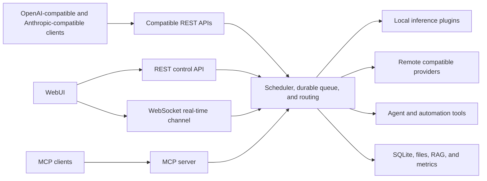

# SoAI: Smart Orchestrator for Artificial Intelligence

SoAI is a feature-rich agent platform that unifies local inference engines and remote providers behind one resilient orchestration layer. It provides OpenAI-compatible and Anthropic-compatible client APIs and a complete WebUI with chat, tools, automations, file management, hardware control, and a RAG knowledge base.

[Documentation](https://soai.to/documentation/) · [Project and releases](https://github.com/GetSoAI/SoAI) · [Release notes](RELEASE_NOTES.md) · [SoAI Connect](https://github.com/GetSoAI/SoAI_Connect) · [License](LICENSE.md) · [Privacy](PRIVACY.md) · [Security](SECURITY.md)

## What SoAI solves

Each inference backend (llama.cpp, Ollama, vLLM) and each remote provider has its own API, model names, and process lifecycle. You install and update each one by hand; every client is configured for one backend at a time; switching backends means downtime and reconfiguration; and a crashed backend takes your requests with it.

SoAI puts one compatible API in front of all of them. Installing any inference backend is as simple as clicking a button. OpenAI-compatible clients such as Open WebUI, LibreChat, Codex, and Cursor point at SoAI once, as do Anthropic-compatible clients such as Claude Code. Both formats reach every configured model, and custom scripts can use either one. SoAI routes requests, starts and stops local backends on demand, queues work so backends do not overload, and retries or reroutes on failure, with load balancing and failover across backends and providers through virtual models.

SoAI is also complete on its own. Its WebUI is a multi-user and multi-device environment for chat, agents, and day-to-day work with your models, kept in sync in real time on every connected device, with hardware monitoring, benchmarking, and GPU control included.

The UI ships in 22 languages:

🇿🇦 Afrikaans, 🇸🇦 Arabic, 🇨🇳 Chinese (Simplified), 🇹🇼 Chinese (Traditional), 🇳🇱 Dutch, 🇬🇧 English, 🇫🇷 French, 🇩🇪 German, 🇮🇳 Hindi, 🇮🇩 Indonesian, 🇮🇹 Italian, 🇯🇵 Japanese, 🇰🇷 Korean, 🇮🇷 Persian, 🇵🇱 Polish, 🇵🇹 Portuguese, 🇷🇺 Russian, 🇪🇸 Spanish, 🇹🇭 Thai, 🇹🇷 Turkish, 🇺🇦 Ukrainian, and 🇻🇳 Vietnamese.

## Architecture



SoAI keeps these protocol surfaces separate. Client requests to `/v1/*` use REST, where OpenAI-compatible streams use OpenAI SSE and Anthropic Messages streams use Anthropic named SSE events. WebUI and administration requests to `/api/v1/*` also use REST. The WebSocket at `/api/v1/system/ws` carries live events, snapshots, and interactive sessions. MCP requests to `/mcp` use streamable HTTP and require a personal access token.

## Plugins

Plugins let SoAI support additional inference engines and capabilities while keeping the same API and WebUI. You can add trusted third-party plugins from a file or URL and manage them from the WebUI, which also shows when a plugin cannot run or needs attention. Plugins run software on the SoAI host, so only install them from sources you trust.

If a local or remote service already offers an OpenAI-compatible API, the External plugin can connect it directly, so you do not need to create a custom plugin. Developers who want to build a new integration can follow the guides in the [documentation](https://soai.to/documentation/).

## Inference and model management

SoAI bundles eight plugins for inference and remote-provider access. In the table below, "All platforms" means Linux, Windows, and macOS.

| Plugin | What it does |
| --- | --- |
| Ollama | Local models through a managed Ollama server, plus Ollama Cloud. SoAI downloads and controls the local Ollama binary. All platforms. |
| llama.cpp | GGUF models through SoAI's own llama-server process. CPU, NVIDIA, AMD, Intel, Vulkan, and Apple Metal. All platforms. |
| vLLM | High-throughput inference server for transformer and GGUF models. NVIDIA, AMD, and Intel GPUs on Linux. macOS on Apple silicon is CPU-only. No Windows support. |
| cTranslate2 | Translation using Helsinki-NLP Marian models converted to CTranslate2 format. CPU only. All platforms. |
| Embedding | Dedicated embedding runtime for GGUF models. Same hardware and platform support as llama.cpp. |
| Whisper | Speech-to-text using OpenAI Whisper models. CPU, NVIDIA, AMD, Apple MPS, and Intel XPU. All platforms. |
| MeloTTS | Multilingual text-to-speech with downloadable language packs. CPU, NVIDIA, and Apple MPS. All platforms. |
| External | Any cloud or local OpenAI-compatible API: OpenRouter, OpenAI, Anthropic, Groq, Together AI, a local inference backend, or another SoAI instance. All platforms. |

### Model and plugin setup

Download supported models from remote sources such as Hugging Face and Ollama or from local storage, selecting variants and quantizations where the provider exposes them, with download size and resource estimates shown before installation. You can also upload model files or place them in a configured model directory. Per-model configuration, parameters, and backend startup options are stored centrally, GPUs are assigned per plugin, and managed local backends are installed, updated, and removed from the WebUI. The External plugin connects to an existing remote or local API.

Each plugin defines its own supported formats, devices, model options, and startup controls, and the Plugins page shows what is available on your machine.

### Virtual models and routing

A virtual model assigns one model identifier to two or more configured models, each paired with the plugin that serves it. SoAI handles the number of runnable plugins based on your settings. The router scores eligible targets by backend availability, queue pressure, and whether the plugin has loaded the model, and if one target fails it selects another eligible target with no interruption for the client.

`/v1/models` lists configured models even when a local backend has stopped, and SoAI can start that backend for a request. If `MAX_CONCURRENT_PLUGINS` has no free slot, SoAI will unload an inactive backend first and start the requested one automatically.

## Compatible client APIs

SoAI implements OpenAI-compatible endpoints plus an Anthropic-compatible Messages surface for Claude Code. For inference and media requests, the selected model and plugin determine which operations and fields they support (the user can override any capability).

| Capability | Endpoint |
| --- | --- |
| Chat completions | `/v1/chat/completions` |
| Responses | `/v1/responses` |
| Anthropic Messages | `/v1/messages` and `/v1/messages/count_tokens` |
| Legacy completions | `/v1/completions` |
| Models | `/v1/models` |
| Embeddings | `/v1/embeddings` |
| Image generation, editing, and variations | `/v1/images/*` |
| Audio transcription, translation, and speech | `/v1/audio/*` |
| Files | `/v1/files/*` |

To connect a client, set the base URL, a model or virtual model identifier, and an API key if you created one. OpenAI-compatible clients use the OpenAI routes, whose streams use OpenAI SSE records and terminate with `data: [DONE]`. Claude Code and other Anthropic-compatible clients use the Messages routes with Anthropic request, response, error, and named-SSE event shapes, which accept the same SoAI API key through either `x-api-key` or a bearer token.

### Authentication and quotas

Until you create the first user, SoAI blocks `/v1/*`, MCP, and protected `/api/v1/*` routes, leaving open the setup wizard, health checks, static UI assets, and the public information routes needed for setup. After setup, users sign in to the WebUI with session authentication, and `/v1/*` handles API keys as follows:

- With no configured keys, the API accepts requests without a bearer token
- Creating the first key makes a valid bearer token mandatory
- Revoking a key disables it and leaves key authentication on
- Deleting all keys opens the API again

Create a key before you make an instance reachable beyond loopback or a trusted private network, because until the first key exists anyone who can reach the port can use `/v1/*`. SoAI stores keys as salted HMAC hashes and shows the plaintext once, at creation. A key can carry an expiration date, a rotation reminder, and hourly, daily, weekly, and monthly request or token quotas, and selected routes can also be throttled by client IP. MCP always requires authentication through personal access tokens that each user creates in the WebUI.

## Scheduling and resilience

### Queues and concurrency

SoAI manages inference capacity in layers. It orders waiting requests, limits how much work each user or background workload may run, limits how many local backends run at once, and gives each plugin its own bounded queue, with queue size, per-plugin concurrency, request timeouts, and inactivity-based unloading as separate controls. Plugins can also report whether their backend handles one request at a time or several in parallel. Controlled testing showed that SoAI stays available and usable through bursts of thousands of simultaneous requests across one or multiple plugins, and longer timeouts let more queued requests complete.

The scheduler deduplicates exact requests, so matching in-flight requests share one inference run. It retries transient failures and server errors that the retry policy marks safe, within a bounded attempt count, honors `Retry-After` on rate-limited remote responses, cancels work when a client disconnects if the configuration enables that and the selected plugin supports it, and keeps durable records that SoAI reconciles after a process restart.

### Health monitoring

The Plugin Guardian watches plugin and runtime health. It's configurable and detects hung inference and health-ping failures, then inspects runtime state for persistent errors, stuck transitions, or flapping. Recovery revalidates persistent runtimes in place, and for managed runtimes it stops the backend and requests model discovery so configured models can start again. Guardian recovery has its own attempt limit, and SoAI quarantines a plugin and trips its circuit breaker when those attempts are exhausted or recovery times out. For local inference plugins, the breaker also counts health-affecting request failures within a configurable window: reaching the threshold blocks new dispatch, and after the cooldown a half-open state admits one probe that either closes the circuit or opens it again. The Plugins page reports both states and lets you reset the circuit after correcting the cause.

### Disk protection

SoAI always checks available storage before supported operations start writing, reserving the expected capacity when the total size is known and each chunk as it arrives when it is not. Space claimed by active jobs counts against what remains, so concurrent operations cannot rely on the same free capacity, and a configurable safety margin is always kept back. Operations that do not fit return a disk-space error, and reservations left by ended processes stop counting at the next check. This covers downloads, uploads, file operations, backup and restore, archive extraction, browser and media output, and knowledge-base storage.

### Offline mode

Offline mode limits SoAI network access to loopback, private, and link-local addresses. The WebUI remains available over your local network and installed backends can continue to run local inference, while requests to public providers and websites return an offline-mode error. SoAI disables model downloads, backend installation, software updates, and mail and calendar synchronization while offline.

## WebUI and agents

The WebUI is where users chat with agents and manage their SoAI instance. The same interface handles models, backends, files, knowledge, terminal sessions, prompts, and automations, and the Settings page covers connected mail, calendar, and messaging accounts as well as users, permissions, backups, and system configuration. Live views show requests, queues, plugin state, and hardware or network activity. Each account only sees the pages and actions it can access. Preferences and supported page layouts are saved per user; chat, logs, terminal, and hardware can open in separate windows; and large conversations, file listings, and logs remain usable as they grow.

### Conversations

Chat mode handles normal replies, Plan mode prepares and tracks steps, and Execute mode lets the agent act through enabled tools. Plans, tool calls, arguments, results, code changes, media, and subagent activity appear in the transcript as the work happens. You can require approval for protected tools, answer questions from the agent, queue another message, steer active work, or stop the run. SoAI exports a conversation as JSON or as a styled PDF containing the transcript, model details, attachments, tool activity, compactions, and comparison variants.

Each conversation keeps its model selection, system prompt, generation settings, tool access, workspace folder, knowledge, voice setup, and display choices with the transcript. You can change models between turns or compare replies from several models to the same prompt and move among their answers in place. Reusable presets carry parts of a setup into other conversations. Conversations can be searched, renamed, colored, favorited, archived, or cloned: a clone is independent, while editing an earlier user message or regenerating an answer removes the later turns and starts again from that point. Unsent drafts sync between devices, and your local text is preserved if another device changes the same draft. The complete history remains visible even after older messages leave the model's active context, and context compaction summarizes older messages on demand or automatically.

Direct attachments give the current message access to selected files or folders, while knowledge uploads index larger collections for retrieval throughout the conversation. Upload from your device, browse the SoAI workspace, paste SoAI local file links, or photograph a document with a camera. Parsers handle source code, office documents, PDFs, images, audio, video, archives, and messaging exports, and configured speech models add dictation, spoken replies, and hands-free voice calls.

## Tools, automations, and integrations

### Agent and MCP tools

SoAI registers more than 100 tools for chat and background automations. They cover:

- Web search, browsing, screenshots, downloads, and browser use
- File operations, archives, OCR, document parsing, and metadata
- Shell commands and interactive terminal sessions
- Image generation
- Speech, audio, and video processing
- Mail, calendar, messaging, and notifications
- Knowledge-base ingestion and retrieval
- Hardware monitoring and control
- Memory and past conversations access
- Subagents and automation

SoAI supports MCP in both directions. External MCP clients can use SoAI's authenticated `/mcp` server, and SoAI assistants can connect to other streamable HTTP MCP servers and use their tools.

### Coding agents

A coding agent or harness can be used with SoAI in three ways:

| Route | What the agent gets |
| --- | --- |
| `/v1` API | SoAI's routed models through compatible client APIs. |
| `/mcp` server | SoAI's tools, resources, and prompts over streamable HTTP. The agent keeps its own model. |
| WebUI terminal | A shell on the SoAI host through an interactive PTY. The agent keeps its own model and provider configuration. |

Configure any client that accepts a custom OpenAI-compatible or Anthropic-compatible endpoint with the SoAI server address, a SoAI model or virtual model identifier, and a SoAI API key. Requests through either format use the same model resolution, capability validation, queueing, quotas, routing, failover, token accounting, and cancellation flow. A client can also connect to `/mcp` for tools, resources, and prompts, separately or alongside the model API. The [documentation](https://soai.to/documentation/) includes connection instructions and setup guides for supported coding agents and other compatible clients.

### Automations

Automations carry out agent work in the background at a chosen local time, either once or on an hourly, daily, weekly, monthly, or yearly schedule. A task can contain several ordered turns, so one run can research a subject, work with the results, and prepare an answer. Choose its model, workspace folder, model settings, and tools, set a time limit, and decide whether tool use must wait for approval.

The WebUI calendar shows upcoming and past runs in day, week, or month views. You can enable or disable an automation, change its schedule, remove individual occurrences, and stop queued or active work. Live status shows each run's progress, with its plan, current work, and result excerpt in the run details. Every run is saved on the Chat page as a normal conversation whose transcript remains available after the automation is deleted, and optional notifications report completion or failure.

### Files

The Files page gives each account a workspace on the SoAI server. An administrator can assign one folder to several accounts for shared work, and permissions control what each person can read or change. The page supports browsing, direct path entry, search, sorting, list and icon views, folder and file creation, in-browser editing, and previews of images, audio, and video. It can upload individual files or complete folders, including huge files and parallel uploads, and copy, move, download, or delete a selection while showing progress and partial failures. Folder and multi-file downloads are sent as ZIP archives.

To use a stored file or folder in a conversation, select Attach on the Files page and paste its SoAI link, or browse your files directly from the Chat page. SoAI reads the item from the assigned workspace without creating multiple versions of the same file.

### Mail, calendar, and messaging

Each user connects mail and calendar accounts on the Settings page with a password or OAuth, and SoAI can test a connection, sync it on demand, and show the last error if something fails. Mail can arrive through IMAP or POP3 and go out through SMTP, and an agent can find and read messages, save attachments to Files, prepare drafts, send messages or reply to them, and update folders or message state. CalDAV tools let the agent find events, create or change one-off and recurring events, respond to invitations, and use event reminders.

Messaging accounts connect Telegram, WhatsApp, or Discord to SoAI. A provider thread becomes a WebUI conversation, and the agent's reply returns through the same service. Each account keeps its own model and agent setup, workspace, tools, and sender policy, admitting either named sender IDs or anyone who can reach the bot, and incoming files and media are processed as attachments.

### SoAI Connect

[SoAI Connect](https://github.com/GetSoAI/SoAI_Connect) is an MIT-licensed Android client specifically made to work with your SoAI server. Download the latest APK from the Releases section of the [SoAI Connect project](https://github.com/GetSoAI/SoAI_Connect) or from soai.to. An iOS-compatible version will be released in the future.

## Hardware and operations

### Monitoring and GPU control

The Hardware page monitors the whole host machine in real time: CPU activity, memory and swap use, storage volumes, network traffic, running processes, and every detected GPU, with readings that can include core and VRAM use, temperature, power draw and limit, core and memory clocks, and active processes. History for CPU, GPU, disk, and network metrics supports selectable devices, measurements, time ranges, chart styles, aggregation intervals, and CSV export.

GPU controls are based on the capabilities SoAI detects for each device. Supported GPUs can expose power, core and memory clock, fan, and reset controls. What is available depends on the card, platform, drivers, permissions, and administrator policy. Three settings slots per GPU let you save and restore a known preset. After an unsafe shutdown, SoAI returns supported tuning controls to their defaults.

SoAIBench tests the GPU itself for inference readiness. Standard and stress runs exercise compute, matrix operations, memory bandwidth, dispatch latency, and sustained mixed workloads while tracking utilization, power, temperature, stability, and score variance. SoAI reports progress as the test runs and keeps per-GPU history to review or export.

### Terminal

The Terminal page opens an interactive Xterm.js shell on the machine running SoAI, directly in the WebUI or in a separate window. It supports any command-line application, can be detached, resizes with the browser window, keeps scrollback for the current session, and lets you change the text size or clear the display.

### Backup and restore

A backup covers the database, configuration, plugin settings, uploaded user data, GPU presets, and more. Restore validates and stages the archive before it replaces active files. From the WebUI you can schedule periodic backups or perform them manually.

## SoAI OS

SoAI OS is a full-featured appliance edition built on SoAI Core. Its custom UEFI image, based on Debian 13 KDE, supports AMD64 and ARM64 and includes installation, encrypted deployment, recovery, and hardware checks. SoAI OS will be released in the future.

## System requirements

SoAI works on CPU-only machines and on machines with one or more GPUs. A GPU is optional, but it is recommended for reasonable local inference speeds.

| Resource | Minimum | Recommended |
| --- | --- | --- |
| CPU | Intel Core i5-2500 or AMD FX-6100 (64-bit CPU with AVX support) | Intel Core i7-6700 or AMD Ryzen 5 1600 |
| RAM | 4 GB DDR3 | 16 GB DDR4 |
| Storage | 128 GB SATA SSD | 512 GB NVMe SSD |
| GPU | Optional.<br>**NVIDIA:** Compatible Pascal-generation GeForce GTX 10-series, Quadro P-series, or Tesla P-series cards.<br>**AMD:** A GPU supported by the selected ROCm or Vulkan runtime.<br>**Intel:** A GPU supported by the selected XPU, SYCL, OpenVINO, Vulkan, or OpenCL runtime. | **NVIDIA:** Compatible Ampere-generation GeForce RTX 30-series, RTX A-series, or Ampere data-center cards.<br>**AMD:** Radeon RX 6000/7000-series or Instinct MI200/MI300-series GPUs.<br>**Intel:** Arc A-series/B-series or Data Center GPU Max cards. |
| Operating system | Debian 12 or 13<br>Ubuntu 24.x or 26.x<br>Windows 10 or 11<br>macOS on Intel or Apple silicon | Same supported operating systems |

The RAM, VRAM, and storage needed for inference depend on the models, quantization, context length, and plugins you use rather than on SoAI alone. Larger models and concurrent requests need more memory, and model files, plugin backends, databases, user files, and working space require storage beyond the application itself.

SoAI can run from a hard disk drive, SD card, or USB drive, but these do not meet the SSD-based storage tiers, and their lower throughput, higher latency, and removable-media failure risks can noticeably affect model loading, database activity, indexing, updates, backups, and concurrent file operations. For heavy workloads you should use an enterprise SSD.

SoAI supports mixed-vendor systems containing NVIDIA, AMD, and Intel GPUs, inventorying and monitoring each detected device through its vendor tools and routing separate plugin instances or backends to GPUs from different vendors. A single CUDA, ROCm, or XPU backend instance binds only to GPUs from its matching vendor, so mixed-vendor inference uses separate backend instances or a runtime that explicitly supports the selected devices. Plugin cloning is especially useful to split parallel work across multiple GPUs.

## Install SoAI

The Linux and macOS archives support x64 and ARM64 hosts, and Windows provides an x64 installer and an x64 compressed archive with the compiled native launcher. Your models and inference plugins determine the hardware requirements, and each plugin and model sets its own platform, GPU, memory, storage, and driver requirements.

### Linux

```bash
curl -fsSL https://soai.to/install/linux | bash
```

To request service installation and automatic startup during unattended installation:

```bash
curl -fsSL https://soai.to/install/linux | SOAI_INSTALL_AUTOSTART=y bash
```

From an extracted Linux release:

```bash
./install-soai-from-release.sh --target /path/to/soai
```

On supported Debian and Ubuntu systems, `--fast` installs required `apt` packages and configures systemd. This path requires root privileges:

```bash
./install-soai-from-release.sh --fast
```

### Windows

Run the following in PowerShell:

```powershell
Set-ExecutionPolicy Bypass -Scope Process -Force; irm https://soai.to/install/windows | iex
```

The Windows release is also available as `SoAI-<version>-windows-x64-setup.exe` and `SoAI-<version>-windows-x64-complete.zip` in the Releases section of the [SoAI project](https://github.com/GetSoAI/SoAI). The setup executable is the standard install and update path. To use the complete archive, verify it, extract it, and run `install-soai-from-release.bat --target C:\path\to\SoAI` from the extracted `SoAI` folder.

### macOS

```bash
curl -fsSL https://soai.to/install/mac | bash
```

The same installer can be run as `./install-soai-macos.command` from a complete local source tree or extracted macOS release.

### Launch commands

Use the launcher for your installation:

```text
Linux:   soai (or ./soai.sh from the installation directory)
macOS:   ./soai.sh or ./soai.command
Windows: soai.exe (double-click the SoAI icon on the Desktop)
```

The Linux installer adds `soai` to the system command path, so you can run it from any directory. Running the launcher without a command starts SoAI. The commands most users need are `status`, `stop`, and `restart`. The `install-deps` command repairs the managed dependencies. Linux and macOS also support `--start-no-browser` for headless use and `--reset-user-password USERNAME` for account recovery, while `--help` gives the complete command reference. The WebUI and API use port `5090` by default, over either HTTP (the default) or HTTPS depending on your settings. To change the workspace directory of your current SoAI user, use the Settings page.

### First run

1. Start SoAI
2. Open the URL printed by the launcher (usually http://127.0.0.1:5090)
3. Complete the setup wizard
4. Open the Plugins page and install a supported backend
5. Add a model from a provider or download a new one, then select it in Chat or use its identifier through `/v1/*`

### API example

```bash
curl http://127.0.0.1:5090/v1/models
```

Send a chat request with a model identifier returned by `/v1/models`:

```bash
curl http://127.0.0.1:5090/v1/chat/completions \
  -H "Content-Type: application/json" \
  -d '{"model":"YOUR_MODEL_ID","messages":[{"role":"user","content":"Reply with one sentence."}]}'
```

Add `-H "Authorization: Bearer YOUR_API_KEY"` if you configured API keys.

## Updates and release verification

Download these Core files from the Releases section of the [SoAI project](https://github.com/GetSoAI/SoAI):

- Linux archive: `SoAI-<version>-linux-complete.zip` for Linux x64 and ARM64
- macOS archive: `SoAI-<version>-macos-complete.zip` for Intel and Apple silicon
- Windows installer: `SoAI-<version>-windows-x64-setup.exe` for Windows x64
- Windows archive: `SoAI-<version>-windows-x64-complete.zip` with the compiled native launcher for Windows x64
- Primary, macOS, and Windows-archive V1 release manifests, their Ed25519 signatures, and SHA-256 sidecars for the artifacts

## Licensing and privacy

[SoAI Source-Available License 1.0](LICENSE.md) governs SoAI Core.

- Personal Use covers private use by one natural person and use by members and guests of that person's household
- Personal Use is free of charge, requires no paid product key, and sets no deployment limit
- An identified organization can run one deployment for a 30-day internal evaluation under the organization evaluation terms
- Section 3.1 permits review, press, benchmarking, research, and teaching within the limits stated there
- Any commercial use and any organizational use outside the listed exceptions requires a commercial license
- Each covered release also becomes available under the MIT License on its Change Date, exactly four years after its first public distribution

[CHANGE-DATES.md](CHANGE-DATES.md) records the Change Date for each release, and [LICENSE.md](LICENSE.md) reserves the SoAI name and branding. The MIT License covers the bundled plugins and SoAI Connect app, and the SoAI OS image contains its separate terms.

### Current availability

Core Personal Use is available now and free of charge. Commercial licenses, organization evaluations, and SoAI OS are temporarily unavailable; purchases, licenses, appliance media, and credentials are not being issued. This operational restriction does not amend the licenses or change any license grant. Organizations can write to [info@soai.to](mailto:info@soai.to) for licensing information or to join the waitlist for future availability, and [COMMERCIAL-LICENSING-AVAILABILITY.md](COMMERCIAL-LICENSING-AVAILABILITY.md) records the current status.

### Privacy

SoAI does not send prompts, model input or output, uploaded files, credentials, or knowledge-base content to the licensor. It contains no product analytics, telemetry, usage reporting, or crash-reporting software, and local models process request content on the host.

## Security

Send suspected vulnerability reports to [security@soai.to](mailto:security@soai.to) rather than opening a public issue. See [SECURITY.md](SECURITY.md) for supported versions, reporting expectations, and response details.

## Contact

- General enquiries and information: [info@soai.to](mailto:info@soai.to)
- Commercial terms and evaluations: [sales@soai.to](mailto:sales@soai.to)
- Security reports: [security@soai.to](mailto:security@soai.to)
- Privacy, GDPR, and data protection: [privacy@soai.to](mailto:privacy@soai.to)
- Official website: [soai.to](https://soai.to) · Documentation: [soai.to/documentation](https://soai.to/documentation/)

Report bugs through the Issues section of the [SoAI project](https://github.com/GetSoAI/SoAI).
